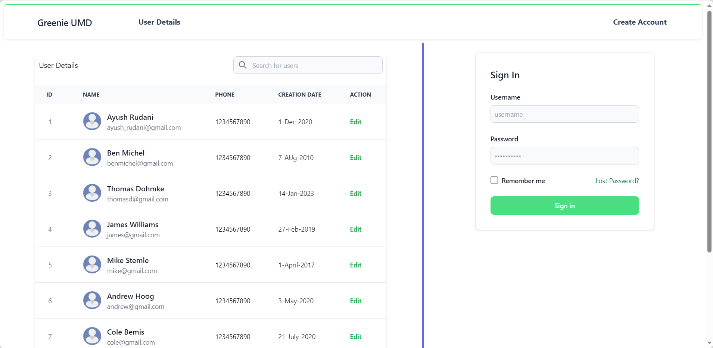
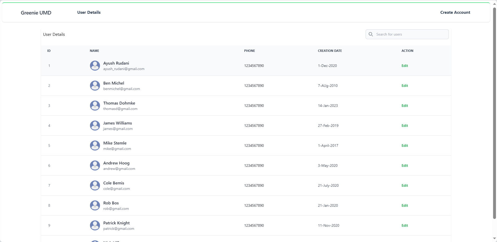
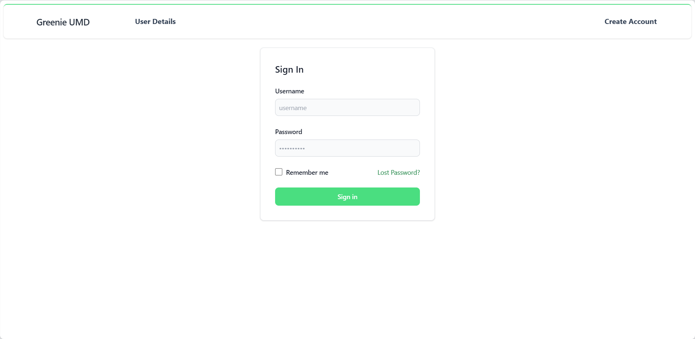
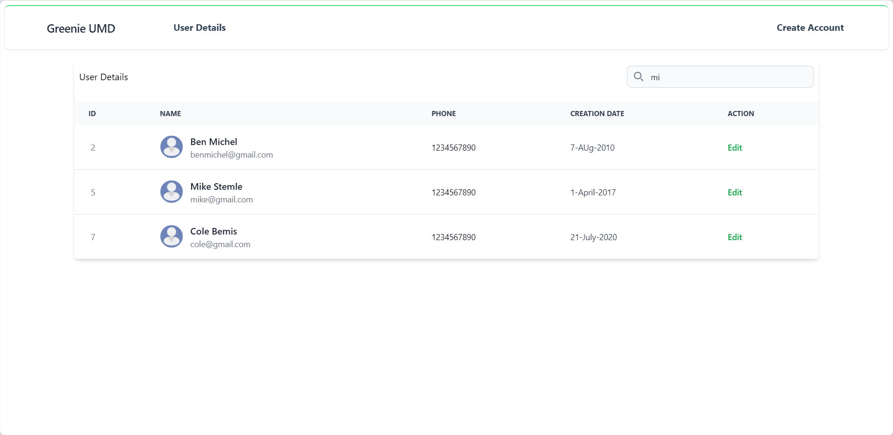
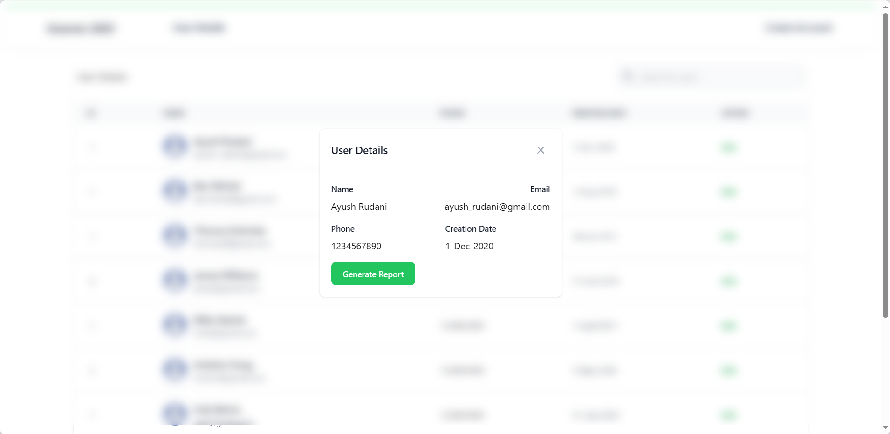
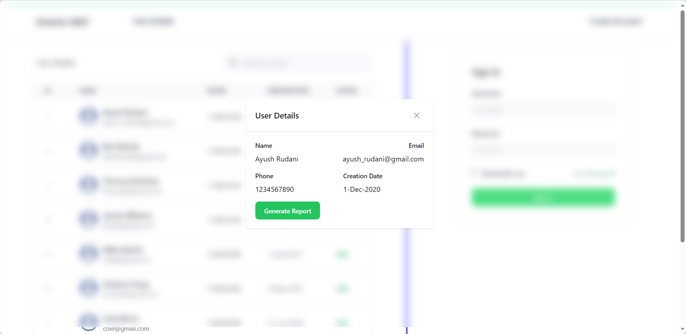

# Greenie Assignment Task

## Assignment Description: Build a User Management Dashboard

This project is a web application featuring a user management dashboard built with Next.js, React, and Tailwind CSS.

## Getting Started

Follow these instructions to get a copy of the project up and running on your local machine for development and testing purposes.

### Prerequisites

Ensure you have the following installed on your machine:

- Node.js (version 20.x)
- npm (Node Package Manager) or Yarn (version 10.x)


### Installation

1. Clone the repository:

   ```bash git clone https://github.com/ayush-rudani/greenie_umd ```

2. Navigate to the project directory:
    ```cd greenie_umd```

3. Install dependencies:
    ```
    npm install 
    # or
    yarn install
    ```
4. Running the Development Server

    ```
    npm run dev
    # or
    yarn dev
    ```

Open your browser and go to http://localhost:3000 to view the application.


<br>

<hr>

<br>

#### Dashboard


#### User Details Page


#### Account Creation Page


#### User Details with search functionality


#### Popup/Modal with a button to generate a report for the selected user.


